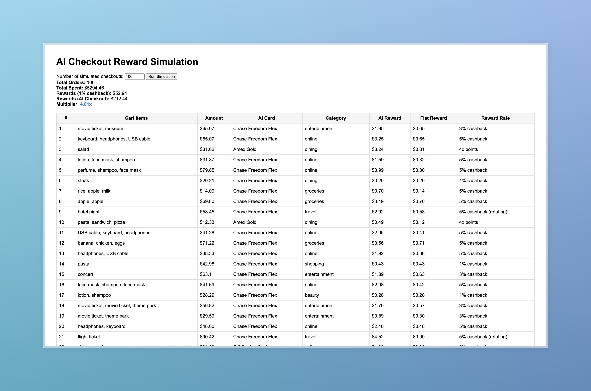

# AI Checkout

## Overview
This repository contains two main components:
- **Chrome Extension:** A browser extension that recommends the best credit card for each online purchase to maximize rewards.
- **Simulation App:** An interactive web app for simulating and visualizing the rewards benefit of using AI Checkout recommendations versus a flat 1% cashback card.

---

## Directory Structure

```
CreditCardAI/
├── extension/           # Chrome Extension files
│   ├── background.js
│   ├── content.js
│   ├── popup.js
│   ├── popup.html
│   ├── styles.css
│   ├── manifest.json
│   ├── cards.json
│   └── icons/
│       ├── icon16.png
│       ├── icon48.png
│       └── icon128.png
├── simulation/          # Simulation and web server files
│   ├── server.js
│   ├── llm.js
│   ├── cards.json   
│   ├── credentials.json # (NOT committed, holds your OpenAI API key)
│   ├── package.json
│   ├── package-lock.json
│   └── public/
│       ├── index.html
│       └── main.js
├── .gitignore
└── README.md
```

---

## 1. Chrome Extension

### Features
- Extracts cart items from shopping sites.
- Infers merchant category using LLM (OpenAI GPT).
- Recommends the optimal credit card for cashback/points.
- User interface for viewing recommendations and managing API keys.

### How to Use
1. Go to `chrome://extensions/` in Chrome.
2. Enable "Developer mode".
3. Click "Load unpacked" and select the `extension/` directory.
4. The extension is now active and will recommend cards as you shop.

---

## 2. Simulation App

### Features
- Generates random simulated shopping carts.
- Calls the same LLM logic as the extension to recommend cards.
- Compares rewards from AI Checkout vs. a flat 1% cashback card.
- Interactive web UI for running and visualizing simulations.

### Setup & Running
1. Go to the `simulation/` directory:
   ```sh
   cd simulation
   ```
2. Install dependencies:
   ```sh
   npm install
   ```
3. Add your OpenAI API key to `credentials.json`:
   ```json
   {
     "OPENAI_API_KEY": "sk-..."
   }
   ```
4. Start the simulation server:
   ```sh
   npm start
   ```
5. Open your browser and go to [http://localhost:3000](http://localhost:3000)

### Demo
Below is an example of the simulation in action. You can see total spend, per-order rewards, and how the AI checkout compares to the 1% cashback baseline.



_**Figure 1:** After 100 simulated orders, this shows total spend, 1% flat cashback vs. AI Checkout rewards, with a total of 4.01× multiplier._

---

## Security & Best Practices
- **Never commit API keys or credentials.**
  - `simulation/credentials.json` and all `.env` files are gitignored.
- **Never commit `node_modules/`.**
  - All dependencies are listed in `package.json` and can be installed as needed.

---

## Skills & Technologies
- JavaScript (ES6+), Chrome Extensions (Manifest V3), OpenAI API, HTML, CSS, Express.js, Node.js, Git

---

## License
MIT
