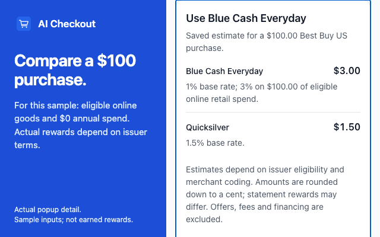
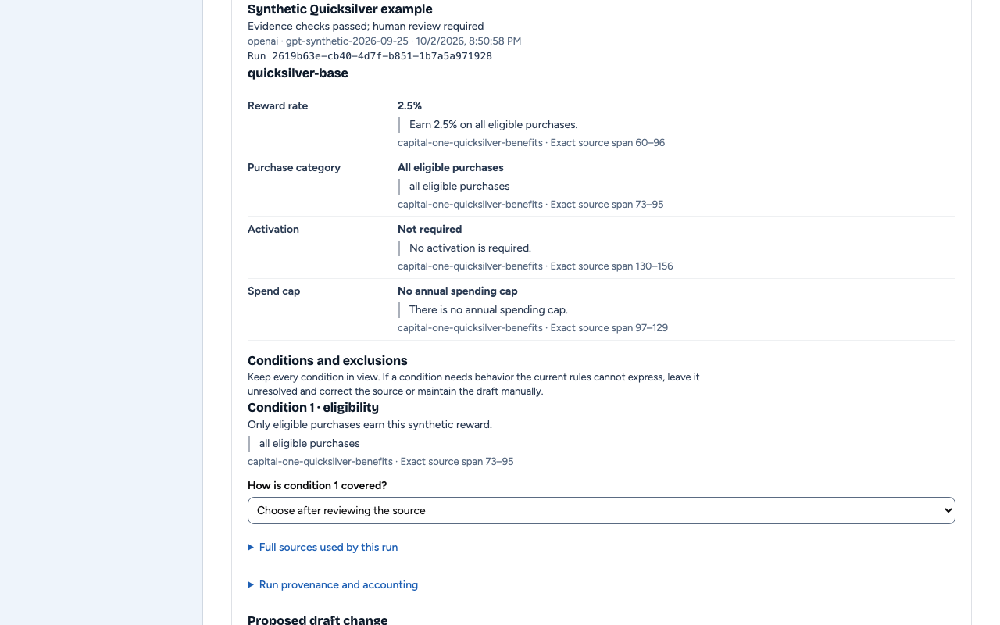
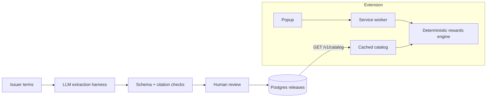

# AI Checkout

A Chrome extension that tells you which card you already own earns the most at checkout, backed by an LLM curation pipeline that keeps the card catalog up to date from issuer terms, with a human approving every change.

<p>
  
  
</p>

[Shopper demo video](docs/release/assets/shopper-demo.mp4) · [Curation demo video](docs/release/assets/full-stack-demo.mp4) · [Design doc](docs/design.md)

## How it works


```mermaid
flowchart LR
  subgraph Extension
    P[Popup] --> W[Service worker] --> R[Deterministic rewards engine]
    L[Cached catalog] --> R
  end
  S[Issuer terms] --> M[LLM extraction harness] --> V[Schema + citation checks] --> A[Human review] --> D[(Postgres releases)]
  D -->|GET /v1/catalog| L
```

- **At checkout, no model runs.** A pure TypeScript engine ranks your cards using integer cents/basis points, spending caps, and explicit uncertainty ranges. It works offline and needs no API key.
- **The LLM keeps the rules current.** It turns captured issuer terms into a structured draft where every fact cites an exact source span. Validation rejects any quote that doesn't match the source. A reviewer applies and publishes changes as separate steps; the model has no write path.
- **Everything is versioned.** Prompt, context, and schema versions are hashed into every trace. Catalog releases are immutable and published atomically.

## Highlights

| Area | What's there |
| --- | --- |
| LLM harness | Versioned prompt/context/schema, strict structured output with `known`/`unknown`/`conflicting` states, citation span validation, prompt-injection handling, token/time/cost budgets with atomic reservations, once-only execution, and a private trace ledger ([details](apps/api/src/curation/README.md)) |
| Evaluation | Offline scorer and replay tool for saved traces: field agreement, fact precision/recall, unsupported claims, evidence coverage, false "clear" verdicts, cost and latency ([details](evals/curation/README.md)). Measured on real issuer terms for seven cards, six models, three prompts: the best configuration (gpt-6-astra, guided prompt) reaches 99% end-to-end field accuracy on dev and 97% on held-out issuers with 100% rule recall, and every planted prompt injection is reported; the prompt matters more than the model (65–83% with a two-sentence prompt vs 89–99% guided) ([results](docs/evals/results.md)) |
| Backend | Node 24 + Fastify API, Supabase Auth, PostgreSQL with RLS, a private review schema, and transactional publication ([schema](supabase/README.md)) |
| Review app | React UI for source evidence, per-condition decisions, draft diffs against the published catalog, and separate publication ([app](apps/review/README.md)) |
| Extension | React + TypeScript on Manifest V3 with minimal permissions, a cart reader that only runs when you click it, and state that survives popup closure and worker shutdown ([extension](extension/README.md)) |
| Testing | ~430 unit/component tests, Playwright tests against the packaged extension and review app, SQL policy/concurrency tests, and CI for both stacks |

## Repository

```
extension/                Chrome extension (popup, service worker, cart readers)
packages/rewards-core/    Deterministic rewards engine + catalog schema
packages/catalog-client/  Bounded catalog fetch used by the extension
packages/catalog-review/  Shared curation/review contracts
apps/api/                 Fastify API; curation harness in src/curation/
apps/review/              React review app
evals/curation/           Evaluation corpus, scorer docs, baseline
supabase/                 Migrations, seed, SQL tests
docs/                     Design doc, release materials, verification notes
```

## Run it

Requires Node 24. No accounts or keys are needed for the extension.

```sh
npm ci
npm run lint && npm run typecheck && npm test
npm run build
```

Load `extension/dist` from `chrome://extensions` with Developer mode on. For the API, review app, and local database, see [apps/api](apps/api/README.md) and [supabase](supabase/README.md) (Docker required).

## Status

Working: the extension (2 cards: Quicksilver and Blue Cash Everyday; 2 merchants: Best Buy US and Newegg US), CI, and the hosted catalog API and review app at [ai-checkout-api.onrender.com](https://ai-checkout-api.onrender.com/health) (Render + Supabase).

Next: human verification of the evaluation labels, a larger catalog built from the measured configuration, and a Chrome Web Store release. See the [roadmap](docs/design.md#roadmap).

## License

MIT
