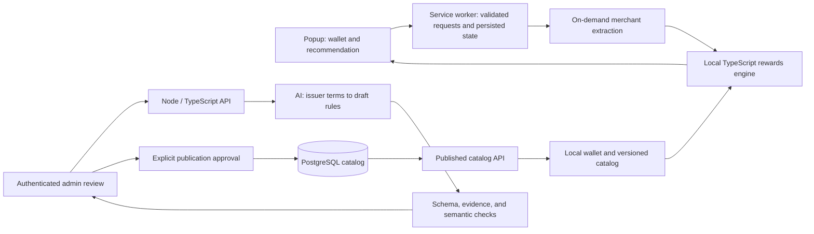

# AI Checkout: release and portfolio plan

Prepared September 25, 2026 for a Chrome Web Store release and a portfolio targeting **full-stack and LLM application engineering**: harnesses, prompts, context, tools, and evaluations.

This is the accepted implementation plan, not a claim that all these features already exist. The persistent build goal is active; [BUILD_STATUS.md](BUILD_STATUS.md) records its checkpoints and remaining gates. Detailed earlier findings remain in [the production readiness audit](audit/PRODUCTION_READINESS.md).

## Implementation progress — September 26

A reproducible [release-media packet](docs/release/assets/README.md) now includes five actual-popup store images, the 440×280 promotional image, shared cart icons and a captioned offline shopper video. `npm run release:media` passes the complete generation and browser verification workflow and binds the packet to the inspected ZIP. Sample data and offline/fixture scope are explicit. The media review returned **ship**. A separate [56-second full-stack recording](docs/release/assets/full-stack-demo.md) now demonstrates the actual review/API/local-database flow, condition decisions, context/accounting and separate publication with clearly simulated model responses. `npm run release:portfolio` rebuilds, records, verifies and cleans up that demonstration. Store approval, hosted evidence and representative live model evaluation remain pending.

A [release preparation packet](docs/release/README.md) now contains accurate default-build listing/privacy/support drafts, reviewer steps, deployment/recovery instructions and an honest portfolio demo plan. Identity/contact/URL placeholders remain unfilled; no page or listing is published. The discovered plaintext-storage gap now has a tested passphrase-protected local vault, explicit setup/migration disclosure, session-only unlock key, lock and confirmed deletion. [Protection evidence](docs/verification/local-protection.md) records recovery and threat limits. Freshness limits still do not erase all saved inputs. [The privacy review](docs/release/privacy-review.md) tracks remaining public links, operational practices and final-release verification; the documents remain drafts.

The owned-card comparison slice is implemented and verified locally. It uses a shared pure TypeScript engine, a sourced two-card snapshot, local wallet persistence, explicit unknown/capped rewards, a default-card tie breaker, validated worker messages, offline operation, and saved-result freshness/deletion. Best Buy and Newegg amount capture read bounded summary rows after user activation, require confirmation, and support manual correction. The popup names the merchant and clears stale inputs/results when it changes. Best Buy's populated/quantity-change live DOM observations remain separate from its native-action fixture tests; Newegg now passes the combined native-toolbar/live-cart flow at two quantities. The default manifest requests `storage`, `activeTab`, and `scripting`; an optional configured catalog build adds only its HTTPS API origin. No user API key is needed. Current evidence and remaining gates are in [BUILD_STATUS.md](BUILD_STATUS.md).

Packaged lifecycle flows verify popup closure while the reader is paused, navigation and temporary-access revocation, and recovery after an observed natural worker stop. The idle test disconnects Playwright during observation and requires both Chrome’s stopped status and a new execution time origin after wake. Default-build browser checks cover Newegg subtotal capture, changed-cart rejection, merchant switching and protected-input recovery; current counts and checkpoint scope are in BUILD_STATUS. The configured HTTPS catalog flow also passes separately. These checks do not replace the final installed-Chrome release smoke test. See [scope and reproduction](docs/verification/extension-lifecycle.md).

Packaging validates the reviewed manifest, runtime files and correctly sized icons, verifies compressed contents, and records per-file/archive hashes. Five packaging checks and an additional native two-card/deletion test against the extracted ZIP pass locally; CI runs the latter before upload. This remains a development artifact. [Package evidence](docs/verification/release-package.md) records its exact hash and limitations. Newegg's observed total was TBD: the reader explicitly captures only the selected subtotal, and the result excludes tax/shipping. Both quantities passed live comparison and cleanup. Its addition advances the bundled pilot to `.2` without extending source dates or expiry; older downloaded snapshots keep their original scope. The latest Best Buy combined live attempt encountered retailer connection errors before product loading.

The catalog database has six locally verified migrations, a reproducible unapproved seed, explicit grants/RLS, private source/draft/reviewer records, atomic publication of immutable public snapshots, and a private extraction-run ledger. Current database/security/race test evidence is recorded in BUILD_STATUS. The Node/Fastify public API reads the published head using only a public key. The extension validates and atomically refreshes catalog data, rejects rollbacks, clears changed-rule usage, and preserves valid cached terms offline. A protected React review interface now compares exact published/draft rules, captures evidence, recovers from stale approval, and publishes only after explicit human review. Its compiled browser flow passes against real local Auth/PostgreSQL. These applications share one npm workspace lockfile. The hosted project is unchanged; live model evaluation and deployment remain unfinished.

The extraction kernel implements versioned context/schema, curated source packs, exact citation checks, explicit unknowns/conflicts, bounded execution, and conservative accounting. Its database orchestration persists private traces, enforces shared budgets/capacity, and prevents duplicate calls after retries or uncertain completion. Authenticated HTTP invocation and inspection pass against real local signed sessions, immutable captures, and a dedicated restricted PostgreSQL login. The official OpenAI Responses SDK adapter is now implemented and verified through intercepted transport, including the compiled API/database path. Scripted fixtures and real local database races pass with zero paid calls. Live model verification, independently labeled model evaluations, and hosted connectivity remain required; fixture success is not model accuracy.

The protected review UI now invokes extraction, restores saved runs, displays field/condition evidence and findings, and records explicit human coverage decisions before applying supported changes. A sixth migration atomically binds application to the originating revision/hash and preserves an audit without publishing. Real HTTP row-lock tests verify concurrent idempotency and session expiry; two built browser flows pass against local Auth/PostgreSQL. Unknown or unsupported output blocks application. Publication is a separate human action; synthetic fixtures do not establish live model quality.

The [local evaluation runner](evals/curation/README.md) now scores saved traces, imports finished ledger runs, and includes 60 synthetic development/reserved cases plus a deliberately abstaining baseline. It rejects inconsistent experiments and withholds aggregate scores for missing cases. Context hashing is portable across PostgreSQL JSONB storage. These are agent-authored, unreviewed diagnostics with paired templates across only two issuer families; the human-labeled, representative held-out evaluation gate below remains open.

The earlier foundation hardening also established the following historical checkpoints (current counts and permissions are in BUILD_STATUS):

- On-demand packaged extraction replaces automatic page scripts and checkout reloads; API host access is restricted to OpenAI and the configured Supabase project.
- Runtime schemas reject malformed carts/catalogs and model-selected cards or rates absent from the supplied catalog. This does not yet establish reward eligibility; the deterministic engine remains necessary.
- Settings supports keyboard dismissal, local-data deletion, and key removal. Raw shopping diagnostics are no longer written by default; storage errors propagate.
- Placeholder background handlers, raw HTML banners, and the unused React Query provider were removed.
- Dependency updates resolved the 18 reported extension advisories; the latest installation reports zero known advisories. This does not assess the separate simulation app.
- Lint, TypeScript, 25 regression/component tests, and two packaged-browser/fixture tests pass. A CI workflow and ZIP packaging command are present locally; GitHub Actions has not run these changes remotely.
- The live Supabase project is now healthy and a public-client check reads four active cards. Its table has RLS and an active-card SELECT policy; unnecessary table grants and reproducible migrations remain follow-up work.
- GitHub authentication and the Supabase connector work. No paid model calls, service purchases, deployment, or store submission occurred.

Still required: the combined Best Buy native-toolbar/populated-live-cart test, final normal Chrome installation and merchant smoke testing, hosted database/API/review deployment, independently labeled live model evaluation, a small tester pass, and final public privacy/support links and dashboard declarations. Store imagery, local shopper/full-stack recordings and drafts are prepared locally. Newegg's passing live check covers one anonymous desktop cart with two quantities, not broad checkout compatibility. The ZIP is a development artifact. Account/budget details for OpenAI and Chrome Web Store are pending; use a zero-spend assumption until clarified.

## Recommended outcome

Deliver a small, dependable product: **choose the best eligible card the user already owns for a supported checkout, explain the estimated reward, and show the conditions behind it.**

Suggested initial scope: US/USD, 5–10 carefully verified card products, and 2–3 tested merchant integrations. Start implementation with two cards and one merchant. Store card product selections, not card numbers, security codes, bank credentials, or transaction histories. Allow manual merchant/amount correction.

The portfolio should demonstrate two connected systems:

1. A reliable Chrome extension with local wallet storage, deterministic reward calculations, and a maintained catalog.
2. An authenticated catalog administration workflow that uses AI to extract draft reward rules from issuer terms, evaluates their accuracy, and requires human approval before publication.

The second system gives AI a useful, measurable responsibility and supplies a real reason for a backend, database, authentication, and an administrative interface. Users can get checkout recommendations without an AI key or a model request on every purchase.

## Historical baseline (before implementation)

Rechecked against revision `9e27b8b` on September 25:

- Production build and TypeScript compilation pass with the existing installed dependencies.
- Lint fails with 14 errors and one warning.
- No extension test suite, CI workflow, or database migration directory was found.
- The popup sends the full active card catalog to the model; there is no owned-card wallet.
- Reward rules are category-to-string mappings, and the model performs eligibility and ranking.
- The model parser checks presence of fields, not a full schema or consistency with known cards/rules.
- Missing content-script recovery reloads the shopping page.
- Recommendation orchestration lives in the popup; the background worker contains placeholder handlers.
- The manifest requests all-host access and registers content scripts on all matching pages.
- Recommendation logging retains cart contents, prompts, and model responses.
- The README advertises Amazon/Target/Walmart configurations absent from the configuration file; its only entry is an unverified Ulta example.

The September 14 audit also recorded dependency advisories, extraction/amount errors, accessibility issues, and an inactive Supabase project. These are historical results, superseded where noted in the implementation checkpoint above. Real retailer checkout and real model invocation remain untested. Existing audit files were preserved.

## Stack and responsibility

| Area | Recommendation | What it demonstrates |
|---|---|---|
| Extension | Keep React, TypeScript, Vite/CRXJS, Tailwind, Manifest V3 | Browser APIs, accessible interface, event-driven lifecycle |
| Local state | Keep Zustand where useful; persist versioned wallet/results in Chrome storage | State management, migrations, recovery |
| Shared business logic | Pure TypeScript rewards package with runtime schemas such as Zod | Domain modeling, validation, reproducible calculations |
| Backend | One Node.js/TypeScript/Fastify API | API contracts, authorization, limits, deployment |
| Database | Keep Supabase/PostgreSQL; add committed migrations, constraints, seed data, and tested access policies | SQL, data integrity, reproducible infrastructure |
| Administration | Small React review screen; Supabase Auth with explicit administrator authorization | Complete frontend-to-API-to-database workflow |
| LLM harness | Provider SDK, bounded orchestration, structured extraction, evidence references, prompt versions, evaluation runner | Prompt/context engineering, tool boundaries, measured failure handling |
| Verification | Vitest, React Testing Library, Playwright Chromium extension tests, GitHub Actions | Unit/integration/browser testing and release automation |
| Operations | Redacted structured logs, request IDs, error reporting, health check, bounded AI spend | Ability to operate and debug the shipped system |

Keep one repository with npm workspaces and one lockfile for the extension, API, and shared packages; elaborate monorepo tooling is unnecessary initially. Keep the existing Vite setup unless a demonstrated packaging limitation requires a change. Remove unused dependencies rather than listing them as implemented features.

Fastify supports schema-based request validation and response serialization; it belongs on the server, not in the extension bundle. [Fastify documentation](https://fastify.dev/docs/latest/Reference/Validation-and-Serialization/).

Commit database changes as migrations and test policies with the intended roles. A public client key is not an administrative secret; privileged service credentials must stay server-side. [Supabase migrations](https://supabase.com/docs/guides/deployment/database-migrations), [row-level security](https://supabase.com/docs/guides/database/postgres/row-level-security).

## Architecture

Issuer terms are untrusted input to the model. AI output is draft data, never executable code or automatically approved policy. The extension only receives validated, published catalog data. A published catalog snapshot can be bundled for first run; cached/bundled rules need a maximum age and deliberate expiry behavior.

Merchant category eligibility must follow issuer rules and known merchant/channel information. Product names alone cannot establish the category the issuer will apply. [Issuer category guidance](https://www.chase.com/personal/credit-cards/rewards-category-faq).

## Implementation sequence

### 1. Establish a dependable baseline

- Fix lint and align release/package versions without changing product behavior unnecessarily.
- Triage and remediate dependency advisories; verify extension loading after updates.
- Add CI for clean installation, lint, type checking, tests, and production packaging.
- Recover/verify the catalog environment and commit a reproducible schema and seed catalog.
- Remove automatic shopping-page reloads and keep a working retry action after failures.
- Stop raw shopping-data logging by default and remove placeholder success responses.
- Correct setup instructions, supported-site claims, and missing license/setup artifacts.

**Exit:** A clean checkout builds; CI passes; basic failures recover safely; the catalog can be reproduced. This milestone does not yet make the existing model-generated recommendation trustworthy.

### 2. Complete one trustworthy recommendation flow

- Add owned-card selection and a default card, persisted locally.
- Define typed card products, reward rules, purchase context, and ranked results with stable IDs.
- Represent amounts in integer minor units and explicit currency; distinguish unit price from line total.
- Compute reward eligibility, amounts, and ordering in the shared TypeScript package.
- Encode sources, effective dates, exclusions, and supported conditions for the pilot catalog.
- Treat unknown activation/cap usage as unknown; use a conservative result or show conditional alternatives.
- Show the recommended owned card, estimated value, runner-up, applied rule, and assumptions.
- Persist results with merchant/cart, wallet, and catalog versions; reject results that no longer match.

**Exit:** Select two owned cards, use one supported checkout, receive the expected rule-backed result, close/reopen the popup, and recover from offline mode. This is the first product milestone to demo.

### 3. Build the full-stack and LLM portfolio feature

- Add a single backend and protected review interface for catalog maintenance.
- Accept bounded issuer-text input plus source URL/date; start with curated inputs to control scope.
- Extract draft rates, categories, exclusions, caps, activation conditions, and validity dates into a strict schema.
- Attach evidence references to extracted fields and explicitly mark missing/ambiguous information.
- Validate source references and semantic consistency; require administrator review of the diff before publishing.
- Separate drafts from published versions and record who approved each release.
- Keep provider credentials server-side, enforce administrator authorization, and add request/concurrency/cost limits.
- Provide a controlled path to republish a corrected catalog version.

Treat the harness as a first-class part of the implementation:

- Version the system instructions, source-context template, response schema, and model configuration together.
- Construct context from identified issuer documents, with explicit boundaries between instructions and untrusted source text. Limit context size and preserve source locations.
- Start with a predictable sequence: prepare context → extract → validate → compare with the current catalog → request human review. Add model-selected tool calls only where experiments show they help.
- If tools are introduced, keep them narrow: retrieve an allowed source by ID, read an existing card rule, or propose a draft. The model has no publication authority or unrestricted network/database access.
- Classify failures: transient provider errors get bounded retries; unsupported documents, missing evidence, refusals, and semantic contradictions become explicit review states. Add time, token, request, and spend budgets.
- Record a trace for each run with document/prompt/schema/model versions, tool inputs/outputs where applicable, validation outcomes, token usage, cost, and latency. Keep secrets and shopping data out of traces.
- Evaluate adversarial source instructions, conflicting terms, oversized input, missing conditions, provider failures, and regressions from prompt changes. Compare fixed orchestration with any proposed agent loop using the same held-out cases.

This is LLM systems engineering. Training models is outside the proposed scope. A reliable fixed workflow is sufficient; an autonomous or multi-agent system is not a prerequisite for demonstrating harness engineering.

Structured output constrains the shape of a response; it does not prove the financial terms were interpreted correctly. Handle refusal, truncation, unsupported input, and conflicting sources deliberately. [OpenAI structured outputs](https://developers.openai.com/api/docs/guides/structured-outputs).

**Evaluation plan:** Start with roughly 50–100 human-labeled cases drawn from representative terms and edge cases. This is a proposed starter corpus, not an achieved dataset or proof of broad accuracy. Separate development examples from a held-out set, grouping related issuer/card documents to reduce leakage. Measure field accuracy, missed conditions, unsupported claims, abstentions, latency, and cost per document. Compare a simple baseline with successive prompts/models. Save source, schema, prompt, and model versions with each result. Use mocks in normal CI and explicitly budget live evaluation runs. [OpenAI evaluation guidance](https://developers.openai.com/api/docs/guides/evals).

**Exit:** A reviewer can demonstrate source text → AI draft → evidence/error review → approved catalog → changed extension result. The evaluation report includes failures and held-out results, not only successful examples.

### 4. Finish extension reliability and usability

- Expand to 2–3 verified merchants, with sanitized DOM fixtures and a recorded real-browser check for each.
- Match exact hosts/subdomains; distinguish checkout, product listing, empty cart, unsupported page, and broken extraction.
- Prefer merchant/amount extraction and manual correction; collect item details only when they serve a documented feature.
- Use user-triggered extraction with `activeTab`/`scripting`, plus only required API origins.
- Validate extension messages, storage records, catalog payloads, and API responses at runtime.
- Handle popup closure, worker restart, navigation, changed carts, storage failures, timeout, and stale catalog data.
- Complete onboarding, keyboard/focus behavior, accessible labels, status feedback, and clear/delete-data controls.

Chrome grants temporary page access through `activeTab` after user invocation. Service workers can terminate, so durable state must be stored rather than held only in memory. [Chrome activeTab](https://developer.chrome.com/docs/extensions/develop/concepts/activeTab), [worker lifecycle](https://developer.chrome.com/docs/extensions/develop/concepts/service-workers/lifecycle).

**Exit:** Unit tests cover reward edge cases; fixtures cover extraction failures; browser tests load the actual packaged extension. Test using Playwright's bundled Chromium and a persistent context, then manually verify the normal Chrome installation and popup experience. [Playwright extension testing](https://playwright.dev/docs/chrome-extensions).

### 5. Prepare the release and portfolio evidence

- Build a versioned ZIP with the manifest at its root; inspect it for secrets and unwanted files.
- Prepare appropriately sized icons, current screenshots, accurate supported-site description, and support contact.
- Publish a privacy policy matching collection, local storage, third-party transfers, retention, and deletion.
- Complete single-purpose, permissions, remote-code, and data-use disclosures in the store dashboard.
- Register/configure the publisher account and provide reviewer instructions for the advertised user flow.
- Keep executable extension logic packaged locally; remote catalog values must remain data interpreted by packaged logic.
- Try a release candidate with a few testers, record failures, and fix them before public submission.
- Document deployment, catalog refresh, error diagnosis, and recovery procedures.
- Add a short demo video, architecture explanation, decision notes, and reproducible benchmark/evaluation report.

These correspond to Chrome's [publishing process](https://developer.chrome.com/docs/webstore/publish), [privacy fields](https://developer.chrome.com/docs/webstore/cws-dashboard-privacy), [program policies](https://developer.chrome.com/docs/webstore/program-policies/policies), and [Manifest V3 requirements](https://developer.chrome.com/docs/webstore/program-policies/mv3-requirements). Approval remains Google's decision.

**Exit:** A new user can install and use the declared scope without developer setup; the release candidate meets the product gates above; the submission materials are accurate. Store approval is a separate external milestone.

## Scope and maintenance budget

Required for public release: correct recommendations, recoverable behavior, reasonable security/privacy, a tested supported surface, and store materials. The AI administration/evaluation feature strengthens the portfolio but is not a Chrome Web Store requirement and can follow the first reliable release.

Defer multi-country support, bank linking, synced wallets, payments, autonomous catalog publication, and broad merchant scraping. Add infrastructure when a measured need appears. A small maintained catalog and a backend with bounded AI usage fit the expected low traffic. Keep checkout recommendations usable during backend/model downtime when the locally available rules remain valid.

Allow several weeks of engineering rather than a packaging afternoon. The existing audit estimates 3–5 engineering weeks for core hardening; the new AI workflow expands that scope. Actual timing depends on experience, available hours, issuer research, and retailer behavior. Store review adds uncertain elapsed time.

After launch, periodically check merchant extraction, card terms, dependencies, and support messages. Low traffic reduces scaling needs but does not remove these maintenance obligations.

## Evidence for a résumé and interview

Describe implemented engineering outcomes and measured results:

- Published extension with a defined merchant/card support matrix and reproducible rewards engine.
- PostgreSQL catalog with versioned rules, migrations, access-control tests, and reviewed publication.
- AI extraction evaluated on a held-out corpus, reporting accuracy by field, condition omissions, latency, and cost.
- Browser integration tests covering lifecycle interruptions, navigation, invalid data, and offline recovery.
- CI-generated release artifacts and a documented operational recovery path.

Do not claim production traffic or customer savings from synthetic simulations. Rework the existing simulation into a reproducible evaluation tool using the shared engine and independent expected answers. Its current public endpoint should not become the deployed application backend without validation, access control, spend limits, and safe rendering.

The first implementation task is milestone 1 followed immediately by the two-card, one-merchant flow in milestone 2. Evaluate that complete slice before expanding the catalog or adding the administration interface.
