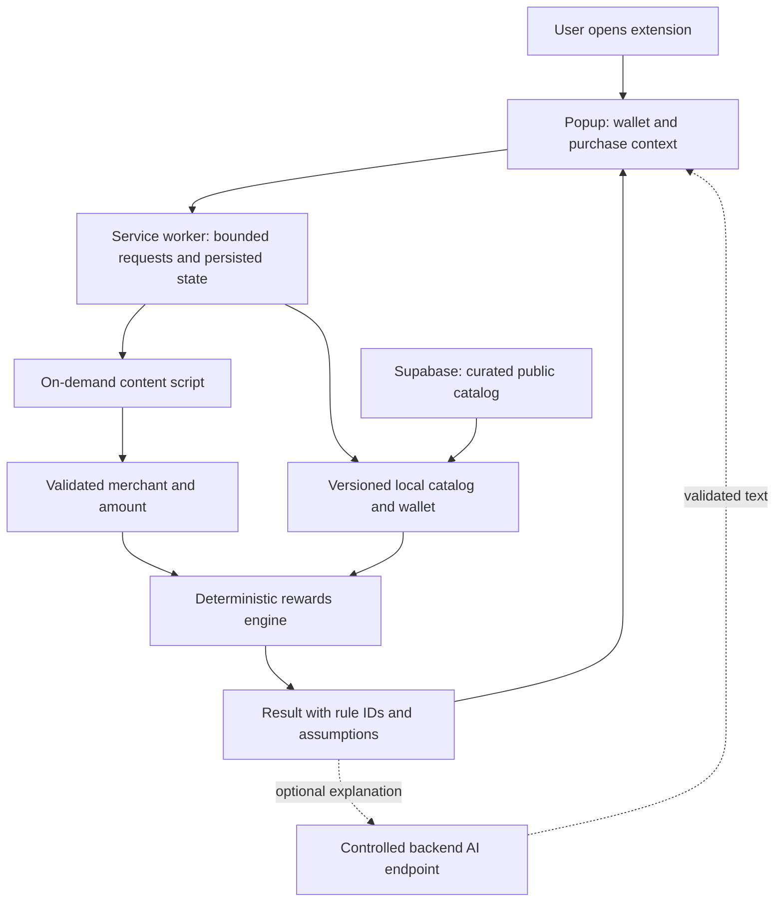

# AI Checkout: production readiness audit

**Audited:** September 14, 2026, America/Los_Angeles  
**Source revision:** `9e27b8b`  
**Verdict:** Functional prototype. Not ready for a public consumer launch.

## Executive assessment

The project demonstrates the basic interaction: extract a cart, fetch a card catalog, ask a model for a recommendation, and display it. The code is small enough to improve incrementally. Keep React, TypeScript, the extractor interface, and the useful parts of the storage layer.

The biggest production gap is **whether the recommendation is correct and useful for this user**. There is no wallet of owned cards. Reward eligibility and ranking are delegated to a model, using a data model that cannot express many real card conditions. Adding more merchants or changing models will not resolve this.

The recommended product promise is:

> At checkout, show the best card I already own, its estimated reward, and the conditions behind the estimate.

Start with a US/USD pilot, a small verified catalog, and three merchant families with tested integrations. This is a proposed scope, inferred from the existing extension; it is not an established product requirement.

### Highest priorities

1. Recover a reliable catalog: the configured Supabase project currently reports `INACTIVE`.
2. Add an owned-card wallet and a deterministic rewards engine.
3. Repair failure recovery, automatic checkout reloads, and popup-lifetime behavior.
4. Validate every external boundary and minimize shopping-data collection.
5. Add meaningful tests, CI, dependency remediation, and a release process.

There are **18 grouped findings: 1 P0, 13 P1, and 4 P2**. These are engineering priorities, not a count of independently exploitable vulnerabilities. P0 blocks core use now; P1 must be resolved before the relevant public release; P2 should be addressed during completion work. Simulation findings apply if that separate app is exposed to users.

## What was actually checked

| Check | Result | Qualification |
|---|---|---|
| Tracked repository inventory | 58 files; extension and simulation reviewed | No application source was changed by this audit |
| Extension production build | **Pass** | Existing installed dependencies; Node 24.6.0, npm 11.5.2, Vite 7.3.1 |
| Extension lint | **Fail: 14 errors, 1 warning** | Explicit `any`, unused code, one effect dependency warning |
| Simulation test command | **Fail: no tests found** | Jest exits 1; it resolved through the existing root dependency directory |
| Extension tests | **No test script or test suite found** | `test-supabase.js` is a manual connection diagnostic |
| Simulation JavaScript syntax | **Pass** | Server, LLM client, and browser client checked with `node --check` |
| Extension npm audit | **18 affected packages** | 13 high, 3 moderate, 2 low; lockfile advisory snapshot |
| Simulation npm audit | **13 affected packages** | 1 critical, 8 high, 2 moderate, 2 low; lockfile advisory snapshot |
| Live Supabase project metadata | **INACTIVE** | Matched the project reference in the extension configuration |
| Live database policy query | **Timed out** | Actual table schema, grants, and RLS remain unverified |
| Supabase security advisor | Returned an empty lint list | Does not establish policy safety while the database query fails |
| Popup browser checks | First run, settings, success, empty cart, API error | Production bundle with audit-only Chrome and service mocks; 360 × 600 and 480 × 600 viewports |
| Targeted local probes | Nine behaviors exercised | Parser, extraction, storage, simulation response handling, HTML rendering |
| UI mechanical detector | Empty finding list | Manual checks found issues the detector did not cover |
| Secret hygiene | `.env` and credentials ignored; configured browser JWT role is `anon` | No OpenAI-like key pattern found in current tracked text; named secret files absent from reachable filename history |

**Limits:** This was not a live purchase test, a penetration test, a full historical secret scan, or a Chrome Web Store review. No paid model requests were made. Merchant selectors were reviewed and exercised on synthetic DOM fixtures, not certified against current authenticated retailer carts. The actual unpacked extension's Chrome messaging, permission prompts, and service-worker restart behavior still need an integration pass. The browser fixture verifies UI behavior, not those extension APIs. The browser CLI was unavailable, so the in-app browser was used for the same visual checks. A fresh isolated `npm ci` installation was not performed.

### Saved evidence

- [Targeted probe results](/Users/evanliu/Projects/AICheckout/audit/evidence/probe-results.json)
- [Extension dependency advisories](/Users/evanliu/Projects/AICheckout/audit/evidence/npm-audit-extension.json)
- [Simulation dependency advisories](/Users/evanliu/Projects/AICheckout/audit/evidence/npm-audit-simulation.json)
- [Popup success screenshot, mocked data](/Users/evanliu/Projects/AICheckout/audit/evidence/popup-success-360.png)
- [UI detector result](/Users/evanliu/Projects/AICheckout/audit/evidence/ui-detector.json)

## Detailed findings

### F01 · P0 · The catalog is unavailable, and its database definition is missing

**Evidence:** The configured Supabase project `AICheckout` reports `INACTIVE`; a read-only `pg_policies` query timed out. [cards.ts](/Users/evanliu/Projects/AICheckout/extension/src/api/cards.ts:32) requires that catalog when no local cache exists. The setup and migration paths referenced in the README are not tracked in this repository.

**Impact:** A new installation cannot complete the normal catalog-backed recommendation flow. An existing cache may hide the outage. Another developer cannot recreate the database or verify the README's RLS claim from source.

**Action:** Restore the intended environment or provision a replacement as a separate operational change; export and commit schema, migrations, a nonsecret seed, and generated database types. Verify anonymous access permits only the intended catalog reads. Add a versioned bundled baseline or an explicit unavailable state. Public/anon frontend keys are expected in this architecture; access policies are the protection, and the observed key was not a service-role key. [Supabase RLS documentation](https://supabase.com/docs/guides/database/postgres/row-level-security).

**Acceptance:** A clean installation can load a current catalog; a clean local database can be recreated from the repository; policy tests verify allowed reads and denied writes.

### F02 · P1 · There is no wallet of cards the user owns

**Evidence:** [Popup.tsx](/Users/evanliu/Projects/AICheckout/extension/src/popup/Popup.tsx:156) passes all active database cards to the model. [useStore.ts](/Users/evanliu/Projects/AICheckout/extension/src/store/useStore.ts:4) has no owned-card selection, and settings only manages an API key.

**Impact:** A recommendation may be impossible to act on at checkout. “Best Card” currently means a model's choice from the entire catalog, not the user's available payment methods.

**Action:** Add a searchable “My cards” onboarding step, persistent card IDs, a default card, and reward preferences. Store card product identifiers and optional nicknames; the recommendation feature does not require card numbers or banking credentials. Keep a future card-acquisition experience separate because it has different inputs and economics.

**Acceptance:** Every recommended card is in the user's wallet. An empty wallet leads to setup. Removing a card invalidates results that reference it.

### F03 · P1 · Reward eligibility and arithmetic need an authoritative engine

**Evidence:** [ai.ts](/Users/evanliu/Projects/AICheckout/extension/src/api/ai.ts:48) asks the model to infer categories from items, consider “online” broadly, and equate each point with one cent. The [card schema](/Users/evanliu/Projects/AICheckout/extension/src/types/index.ts:3) stores reward rules as arbitrary strings. There are no structured caps, activation requirements, validity periods, channel restrictions, geographic restrictions, or merchant exclusions. Price and quantity are omitted from the prompt.

**Impact:** The app cannot substantiate its “highest reward” result or calculate realistic savings. Buying groceries from a retailer does not by itself establish grocery-bonus eligibility: issuer rules depend on merchant classification and exceptions. [Chase rewards category rules](https://www.chase.com/personal/credit-cards/rewards-category-faq).

**Action:** Resolve merchant and purchase channel from curated evidence; apply typed issuer rules; compute rewards in code. Represent point valuation explicitly and show the assumption. Track cap usage and activation only when known; otherwise disclose uncertainty or use a conservative baseline. Use AI for an optional explanation or a category suggestion requiring validation. Annual fees belong in a broader ownership-value analysis, not an arbitrary deduction from an already-owned card's next purchase.

**Acceptance:** Golden cases cover merchant exclusions, online versus in-store purchases, rotating dates, exhausted caps, missing activation, cash versus points, ties, and unsupported currency. Every result records the rule and catalog version that produced it.

### F04 · P1 · Model output is accepted without meaningful validation

**Evidence:** [parseRecommendation](/Users/evanliu/Projects/AICheckout/extension/src/api/ai.ts:120) checks only truthiness. Local probes accepted an object as the card name, a numeric rewards value, and a nonexistent card advertising `100% cashback`. Returned merchant/category values are not checked against the request. DOM-derived names are interpolated directly into the prompt.

**Impact:** Invalid responses can crash rendering or display fabricated financial claims. Page text can influence the prompt. No successful real-world prompt injection was demonstrated; the verified problem is that the application lacks a validation boundary.

**Action:** Validate requests, catalog records, Chrome messages, cached objects, and responses with runtime schemas. Enforce card-ID membership and derive displayed rates from trusted rules. Bound item count, string length, and total payload size. If AI remains, use strict structured output and handle refusals, truncation, and unknown values explicitly; a schema alone does not prove semantic correctness. [OpenAI structured outputs](https://developers.openai.com/api/docs/guides/structured-outputs).

**Acceptance:** Wrong types, unknown card IDs, unexpected merchant values, arbitrary HTML, and model-invented rates are rejected before reaching the recommendation UI.

### F05 · P1 · The first failure removes the user's retry action

**Evidence:** Browser fixtures confirmed that both an empty cart and the first API error leave only Settings. In [Popup.tsx](/Users/evanliu/Projects/AICheckout/extension/src/popup/Popup.tsx:261), an error replaces the initial call to action; the refresh button is conditional on an existing recommendation at line 342.

**Impact:** A normal recoverable failure appears to dead-end the product. The user must reopen the popup or discover that opening and closing settings clears the error.

**Action:** Keep a persistent primary action, with explicit states for empty cart, unsupported page, restricted browser page, disconnected service, invalid credentials, and retryable errors. Offer manual merchant/amount entry when extraction is unavailable. Preserve useful extracted data during a service failure.

**Acceptance:** Every recoverable failure offers a working next action without closing the popup. No-cart and unsupported-site states make no AI call. UI work maps to `$impeccable harden` and `$impeccable clarify`.

### F06 · P1 · Recovery automatically reloads the shopping page

**Evidence:** [Popup.tsx](/Users/evanliu/Projects/AICheckout/extension/src/popup/Popup.tsx:94) calls `chrome.tabs.reload` when its content-script readiness check fails.

**Impact:** Clicking for advice can disrupt checkout, lose unsaved form entries, or reset an in-progress retailer flow. The code path is confirmed; checkout data loss was not induced during the audit.

**Action:** Inject the packaged content script on explicit user activation when allowed, use a typed ready/message handshake, and show actionable errors for restricted tabs. Avoid reloading the merchant page as automatic recovery. Check URL scheme and current document identity before extraction.

**Acceptance:** Missing content script, newly installed extension, blocked URL, and stale tab cases never trigger an automatic retailer reload.

### F07 · P1 · Work and results are tied to the popup's lifetime

**Evidence:** Extraction, catalog fetching, and the model request all run from [Popup.tsx](/Users/evanliu/Projects/AICheckout/extension/src/popup/Popup.tsx:54). Zustand state is in memory; latest-recommendation storage helpers are unused. [callOpenAI](/Users/evanliu/Projects/AICheckout/extension/src/api/ai.ts:86) has no timeout, cancellation signal, or retry policy. Background API handlers are placeholders.

**Impact:** Clicking back into checkout closes the popup, and there is no durable state from which it can resume or show the previous result. Slow provider responses can leave the loading state without a deadline. Chrome explicitly closes action popups when focus moves away. [Chrome popup lifecycle](https://developer.chrome.com/docs/extensions/develop/ui/add-popup).

**Action:** Put bounded orchestration in the service worker and persist request/result metadata. For longer remote jobs, use a backend job ID that can be polled after reopening. Service workers can also stop, so moving code alone is insufficient. Key results to tab/document identity, merchant, cart fingerprint, wallet version, and catalog version. Add request IDs, timeout budgets, cancellation, bounded retries for transient errors, and stale-result rejection.

**Acceptance:** Reopening the popup shows the applicable completed or pending result. Navigating or changing the cart cannot display a result for a different checkout. Provider timeouts lead to a recovery state.

### F08 · P1 · Merchant extraction has no trustworthy support boundary

**Evidence:** The only configured simple site is an explicitly unverified Ulta placeholder in [simple-sites.config.ts](/Users/evanliu/Projects/AICheckout/extension/src/extractors/configs/simple-sites.config.ts:15). Amazon, Target, and Walmart have no dedicated configurations despite README claims. [BaseExtractor.canHandle](/Users/evanliu/Projects/AICheckout/extension/src/extractors/BaseExtractor.ts:36) uses substring matching; a probe matched `sephora.com.attacker.example`. [GenericExtractor](/Users/evanliu/Projects/AICheckout/extension/src/extractors/GenericExtractor.ts:90) accepted a normal product listing as a cart.

**Impact:** Unverified pages can produce plausible-looking but incorrect input. A supported extractor returning no items is not distinguished from an empty cart, broken selectors, or incomplete page hydration. The generic fallback is selected for unknown hosts, not automatically after a named extractor fails.

**Action:** Match exact hostnames or proper subdomain boundaries. Establish a cart/checkout context before extracting. Mark integrations as verified, experimental, or unsupported. Return extraction status, provenance, confidence, field completeness, and truncation instead of dropping metadata to an array. Use sanitized HTML fixtures and a small maintained retailer test matrix. Disable the unverified Ulta integration until tested.

**Acceptance:** Product listings and spoofed domains cannot be treated as verified carts. Each supported merchant has empty, populated, delayed-render, changed-selector, duplicate-variant, and currency fixtures. Unsupported sites offer manual input.

### F09 · P1 · Amounts, quantities, and currencies are ambiguous or wrong

**Evidence:** A generic-extraction probe read `$1,299.99` as `$1` because of the price regex. [CartItemsList.tsx](/Users/evanliu/Projects/AICheckout/extension/src/components/CartItemsList.tsx:19) sums price strings without quantity. A fixture containing a `$10` unit price and quantity 3 displayed `$10.00`. [deduplicateItems](/Users/evanliu/Projects/AICheckout/extension/src/extractors/BaseExtractor.ts:127) collapsed two separate lines with the same name into one. The type has no currency or distinction between unit price and line total, although some extractors include Canadian domains.

**Impact:** The displayed “Total” can be materially wrong. Some merchant prices may already be line totals, so blindly multiplying all prices by quantity would introduce a different error. These ambiguities also block reliable reward-amount estimates.

**Action:** Model money in integer minor units with currency; distinguish `unitPrice`, `quantity`, `lineTotal`, merchant subtotal, tax, and shipping. Prefer the merchant's authoritative checkout amount when available. Preserve stable line-item IDs/variants, and label incomplete sums as estimates or partial subtotals.

**Acceptance:** Tests cover commas, decimals, unit/line totals, missing prices, quantity greater than one, repeated names with distinct SKUs, discounts, and unsupported currency. No silent `$` currency assumption.

### F10 · P1 · Consumer credentials, permissions, and privacy controls are incomplete

**Evidence:** [manifest.json](/Users/evanliu/Projects/AICheckout/extension/manifest.json:6) requests all hosts and installs content scripts on all matching pages. [storage.ts](/Users/evanliu/Projects/AICheckout/extension/src/utils/storage.ts:44) persists the user-supplied OpenAI key locally; no `setAccessLevel` restriction is present. [logRecommendation](/Users/evanliu/Projects/AICheckout/extension/src/utils/logging.ts:11) always stores and logs full cart/prompt/response data, regardless of the unused debug setting. The settings export helper includes the key, although no settings-export UI is currently wired. Settings has no key-delete or all-data-delete control.

**Impact:** The bring-your-own-key flow creates substantial consumer onboarding friction and a broader local secret-handling surface. Shopping content is retained without a retention-age control or an explicit disclosure in the normal recommendation flow. All-host access increases the extension's permission scope.

**Action:** Make the normal deterministic flow work without an OpenAI key. Put any product-owned AI key behind a controlled backend; never embed it in the extension. For optional BYOK, restrict storage access to trusted contexts and provide deletion. Prefer `activeTab` plus user-triggered script injection, with explicit permissions for necessary API origins, or narrowly scoped optional merchant permissions. Make raw diagnostic logging opt-in, time-limited, and redacted. Add clear data-use disclosure, retention controls, deletion, and a privacy policy that matches actual behavior.

Chrome local storage is accessible to the extension's content scripts by default; that does **not** mean ordinary merchant-page JavaScript can directly read it. [Chrome storage documentation](https://developer.chrome.com/docs/extensions/reference/api/storage). OpenAI recommends keeping product API keys server-side. [OpenAI authentication guidance](https://developers.openai.com/api/reference/overview). Chrome Web Store requires appropriate user-data disclosures and a privacy policy for products handling user data. [Chrome Web Store user-data policy FAQ](https://developer.chrome.com/docs/webstore/program-policies/user-data-faq).

**Acceptance:** No developer secret enters a build artifact, an export, or ordinary logs. The user can understand and delete retained data. Permissions correspond to implemented features. Verify actual RLS separately under F01.

### F11 · P1 · Dependency advisories need triage and remediation

**Evidence:** The saved npm audit snapshots show 18 affected extension packages and 13 simulation packages. Examples include Vite, Rollup, CRX tooling, and Node networking dependencies in the extension graph; Express and `form-data` in the simulation graph. The simulation lock pins `form-data` 4.0.3, which the registry rates critical for an applicable advisory range.

**Impact:** There are known affected versions in the build and runtime dependency trees. Severity totals are not proof that all issues are exploitable in this app. Vite/Rollup findings primarily concern tooling; Node-only dependencies in an extension graph may not execute in the browser; the simulation's current chat path does not by itself demonstrate a vulnerable multipart request.

**Action:** Update compatible dependencies and lockfiles in a dedicated change, then validate builds and extension loading. Classify each remaining finding by installed version, executable path, input exposure, and remediation. Move build-only dependencies such as the CRX plugin and Chrome types into development dependencies; this improves classification but does not fix vulnerabilities. Use automated update PRs and a documented policy for relevant high/critical findings. Avoid an unreviewed forced major upgrade.

**Acceptance:** No untriaged high/critical finding remains in a shipped execution path. Tooling exceptions have an owner and expiry. The extension still loads and completes its fixture flow after upgrades. The [saved advisory JSON](/Users/evanliu/Projects/AICheckout/audit/evidence/npm-audit-simulation.json) includes individual advisory URLs and affected ranges.

### F12 · P1 · There is no release-quality automated verification or operating process

**Evidence:** No CI workflow or extension test suite was found. Simulation Jest has no tests. Lint fails. [test-supabase.js](/Users/evanliu/Projects/AICheckout/extension/test-supabase.js:37) prints many connection failures and returns without setting a failing process exit code. No tracked deployment runbook, operational metrics, alerting, rollback procedure, or staging configuration is present.

**Impact:** A successful TypeScript build currently gives too little evidence that recommendations are correct, the extension works in Chrome, or a release can be operated and recovered.

**Action:** Gate changes on clean install, lint, type checking, rules tests, extractor fixtures, production build, and real Chromium extension integration tests with mocked remote services. Add catalog/RLS tests and permission/manifest checks. Give diagnostic scripts meaningful exit codes. Establish staging versus production configuration, versioned artifacts, support contact, rollback/forward-fix procedure, and privacy-safe metrics.

**Acceptance:** A new developer can reproduce CI from a clean checkout. A release records source revision, catalog/rules version, manifest version, dependency results, and browser verification. Required tests actually fail on malformed responses, amount errors, and stale results.

### F13 · P1 · Accessibility failures affect core controls and feedback

**Evidence:** [SettingsModal.tsx](/Users/evanliu/Projects/AICheckout/extension/src/components/SettingsModal.tsx:94) has no dialog semantics, focus management, or Escape handler. Browser inspection found two unnamed buttons; focus remained on the obscured background trigger, and Escape did not dismiss the modal. Errors have no alert/live region, while the active skeleton variant ignores its loading message. Debug rows are clickable `div`s. Show-more and debug toggles omit expanded state. [globals.css](/Users/evanliu/Projects/AICheckout/extension/src/styles/globals.css:38) uses white normal-size button text on `#3b82f6` at **3.68:1**; gray-400 text on white is **2.54:1**.

**Impact:** Keyboard and assistive-technology users cannot reliably understand or operate the settings and asynchronous states. The measured ordinary-text combinations fall below the 4.5:1 AA threshold. [WCAG contrast guidance](https://www.w3.org/WAI/WCAG22/Understanding/contrast-minimum.html).

**Action:** Implement a correctly labelled modal with initial focus, contained tab navigation, Escape dismissal, and focus restoration; give icon controls accessible names. Use status/alert semantics for async feedback, real buttons for log rows, and `aria-expanded` for disclosures. Darken text/button tokens and provide a deliberate reduced-motion alternative. Follow the [WAI modal dialog pattern](https://www.w3.org/WAI/ARIA/apg/patterns/dialog-modal/).

**Acceptance:** Keyboard-only completion, automated accessibility checks, contrast checks, and a screen-reader smoke test pass for onboarding, settings, success, loading, and failure. Use `$impeccable harden` and `$impeccable colorize`.

### F14 · P1 · The simulation is unsafe to expose as a public API in its current form

**Evidence:** [server.js](/Users/evanliu/Projects/AICheckout/simulation/server.js:50) accepts unauthenticated requests that each trigger up to 500 sequential provider calls, without a rate limit, concurrent-job limit, cancellation, or spend budget. An async handler can fail outside its `try`: a mocked model response containing valid JSON `null` produced `Cannot read properties of null (reading 'card')`. The Express 4 handler has no outer rejection wrapper. [main.js](/Users/evanliu/Projects/AICheckout/simulation/public/main.js:33) interpolates model-derived card/category fields into `innerHTML`; a harmless markup probe became a real DOM element. The extension also contains a dormant raw-HTML banner sink, but its popup banner builder is unused.

**Impact:** Public deployment would expose avoidable spend/availability risk. Invalid model output can leave requests unhandled; HTML insertion can permit content injection and, depending on payload and page protections, script execution. This audit verified markup interpretation, not a deployed exploit.

**Action:** Keep the simulation an internal tool until it has request validation, authentication if remotely reachable, rate and cost budgets, bounded jobs, timeout/cancel behavior, and central async error handling. Render text through safe DOM/React APIs. Remove the unused extension HTML-banner path or replace it with typed, escaped rendering. The simulation browser client also needs `response.ok` checks, error UI, and duplicate-submit prevention.

**Acceptance:** Oversized and repeated requests are bounded, malformed/null model responses return controlled errors, client disconnects do not silently fund unlimited work, and untrusted fields render as text.

### F15 · P2 · Cache and storage failures can silently mislead users

**Evidence:** [cards.ts](/Users/evanliu/Projects/AICheckout/extension/src/api/cards.ts:82) returns cached cards after any fetch failure, without a maximum fallback age or stale label. Even an empty active-card response falls back to the old catalog. [storage.ts](/Users/evanliu/Projects/AICheckout/extension/src/utils/storage.ts:22) resolves writes without checking `chrome.runtime.lastError`; a quota-error probe still resolved successfully. Catalog content and timestamp are separate writes.

**Impact:** Deactivated or expired offers can continue to be recommended without warning. Settings can say “saved” after a write failure. Corrupt storage has no schema/version migration path.

**Action:** Store a versioned cache envelope atomically, validate it on read, distinguish stale versus current data, and establish a bounded offline policy. Fail closed on invalid or revoked offer rules. Use promise-based Chrome APIs or propagate callback errors, and surface recovery for quota/corruption failures.

**Acceptance:** Expired, empty, corrupted, and revoked catalogs behave deliberately. Simulated write failures cannot produce a success message.

### F16 · P2 · Simulation results do not establish real savings or model quality

**Evidence:** [server.js](/Users/evanliu/Projects/AICheckout/simulation/server.js:16) creates category-specific item lists and websites named after their categories, uses unseeded randomness, and compares only with a 1% card. Failures silently receive a 1% fallback. [llm.js](/Users/evanliu/Projects/AICheckout/simulation/llm.js:16) uses a different model/prompt/token budget from the extension. Its local static catalog diverges from the extension's database. Reward evaluation trusts the model's inferred category instead of comparing with a known correct category.

**Impact:** The demo mixes classification, card selection, and evaluation assumptions. It cannot substantiate a production savings multiplier or show that AI improves on a simple rules lookup.

**Action:** Convert it into a repeatable evaluation harness using the shared production rules engine. Keep merchant/category ground truth independent of model output. Include exclusions and ambiguous cases. Compare with the user's default card, their best flat-rate card, and an oracle using verified rules. Record model/provider failures, ranking accuracy, reward error, latency, and cost separately.

**Acceptance:** Seeded runs are reproducible; failures are visible; extension and evaluation use the same catalog/rules version. Synthetic results are labelled and never presented as observed customer savings.

### F17 · P2 · Documentation and product onboarding overstate completeness

**Evidence:** [README.md](/Users/evanliu/Projects/AICheckout/README.md) advertises Amazon/Target/Walmart configurations that do not exist. [extension/README.md](/Users/evanliu/Projects/AICheckout/extension/README.md) references missing Supabase/backend guides and an absolute developer-local document. It describes GPT-3.5 while extension code uses GPT-4o-mini. Catalog caching exists, but recommendation restoration is not implemented. The first-run screen presents missing configuration as an error.

**Impact:** New users and contributors get misleading expectations and cannot follow a complete supported setup path. There is no user-facing explanation of verified support, reward assumptions, or how to correct a result.

**Action:** Write a concise product brief and an accurate capability matrix. Add welcome → owned cards → preferences/data disclosure → first recommendation. Include manual input, rule freshness, conditional eligibility, “why this card,” comparison with alternatives, and a report-incorrect-result action. Replace stale setup instructions and align release versions; the package is `0.0.0` while the manifest is `2.0.0`. Add the actual license file if MIT distribution is intended.

**Acceptance:** A new user understands the scope and reaches useful advice without developer tooling. Setup from a clean checkout has no missing references. Map UI work to `$impeccable onboard`, `$impeccable clarify`, and `$impeccable shape`.

### F18 · P2 · Prototype scaffolding adds maintenance cost and distracts from the main task

**Evidence:** React Query is provided in [popup/index.tsx](/Users/evanliu/Projects/AICheckout/extension/src/popup/index.tsx:7) but no queries/mutations use it. [background/index.ts](/Users/evanliu/Projects/AICheckout/extension/src/background/index.ts:104) returns placeholder success responses for prompt/AI messages; its extraction handler returns an empty array. Registry host lookup scans extractors despite repeated O(1) documentation claims. Raw debugging UI appears in the normal recommendation flow. CSS and Tailwind repeat theme definitions. All three differently named icon files are 500 × 500 PNGs. The popup JS bundle is about 371 KB uncompressed / 110 KB gzip.

**Impact:** Parallel unfinished paths make the intended architecture harder to understand and test. The popup spends scarce space on cart details/debugging before helping the user compare rewards. There is no evidence that bundle size alone currently creates a major user performance problem.

**Action:** Consolidate one typed message/orchestration path; delete unused scaffolding or finish it with tests. Choose one data-fetching approach. Move diagnostics behind an explicit developer option while keeping useful explanations in the product. Put the recommendation and estimated value first; collapse cart details by default. Consolidate tokens, size icons correctly, and profile before optimizing the bundle.

**Acceptance:** No message reports placeholder success; primary UI answers “which owned card, how much, and why.” Unused dependencies and duplicated helpers are removed. Use `$impeccable distill`, `$impeccable optimize`, and `$impeccable document`.

## Interface health

### Implementation integrity verdict: fail for release

The visual system is fairly consistent, but the implementation does not yet support its product promise: ordinary failure states dead-end, first run is a configuration error, raw diagnostics are user-facing, and “Best Card” lacks ownership and trustworthy eligibility. These are verified functional/product gaps. The mechanical detector returned no findings; its empty output is not an accessibility or product-quality pass.

| Dimension | Score / 4 | Evidence |
|---|---:|---|
| Accessibility | 1 | Modal semantics/focus, unnamed controls, low contrast, unannounced async states |
| Performance | 2 | Broad content-script registration and generic scans; unused query provider; no latency measurements |
| Responsive design | 3 | Normal fixture fits 360 and 480 widths; long-content/zoom and actual Chrome popup behavior remain to test |
| Theming | 2 | Consistent palette, but repeated definitions and inaccessible foreground/background combinations |
| Implementation integrity | 1 | Core failures and prototype/debug workflow remain in consumer path |
| **Total** | **9 / 20** | **Poor: significant completion work needed** |

These are review judgments using the Impeccable rubric, not a measured production-readiness percentage or formal WCAG certification. A fixed minimum width is reasonable for this desktop extension; mobile-web support and dark mode are not assumed release requirements.

### What is worth preserving

- Manifest V3, TypeScript strict mode, and a passing production build provide a usable foundation.
- The extractor interface, shared helpers, metadata, and config-driven approach support incremental expansion.
- Popup rendering mostly uses React text interpolation, which avoids the simulation's raw-HTML problem.
- The key input is labelled and initially masked; external links use `noopener noreferrer`.
- Cached catalog fallback and bounded log count show attention to resilience, although their policies need improvement.
- Loading/error components and visible recommendation explanations already exist.
- Current local secret files are ignored, and the inspected Supabase client credential has the appropriate public `anon` role.

### Systemic patterns

1. TypeScript interfaces are being treated as validation at runtime boundaries.
2. A successful demo response is better supported than absence, uncertainty, interruption, or failure.
3. Card terms are prose instead of versioned executable business rules.
4. README claims, simulation behavior, and extension behavior have drifted apart.
5. Diagnostic data and consumer-facing information are mixed together.

For the interface work, use `$impeccable harden` first, then `$impeccable onboard` / `$impeccable clarify`, `$impeccable distill`, `$impeccable colorize`, `$impeccable document`, and `$impeccable polish` as the final finishing step. These passes can be run one at a time or together. Re-run `$impeccable audit` after fixes to reassess the score.

## Recommended product scope

### A complete first release

| Capability | First-release behavior |
|---|---|
| Wallet | Choose owned cards from a curated catalog; set a default and optional point valuations |
| Merchant support | Three verified merchant families, clearly labelled experimental/unsupported status elsewhere |
| Purchase input | Confirm merchant and amount; automatically extract only when reliable; allow manual correction |
| Recommendation | Best eligible owned card, estimated reward amount/rate, runner-up, incremental gain versus the user's default |
| Explanation | Show matched rule, conditions, known uncertainty, and terms source/verification date |
| Recovery | Retry, offline baseline when valid, manual fallback, and safe restricted-page handling |
| Continuity | Result survives popup closure and is invalidated when checkout context changes |
| Privacy | Minimal permissions, normal use without a provider key, explicit optional AI data use, delete retained data |
| Feedback | Report a wrong extraction or rule with user-reviewed, redacted context |
| Support | Accurate supported-sites page, changelog, privacy policy, support contact, and release procedure |

Wallet sync, automatic transaction imports, application offers, multiple countries, Firefox, and paid subscriptions can follow a reliable pilot. They are not prerequisites for testing whether the core recommendation is useful. In particular, authentication is optional for a wallet stored only on the device; it becomes necessary when adding private server data or controlling a hosted AI service.

### Suggested recommendation layout

1. **Use: [owned card name]**
2. **Estimated reward: $X at Y%**, plus gain versus the default card when amount and assumptions are known.
3. One sentence explaining the applicable merchant rule.
4. Conditions requiring action or confirmation, such as activation or cap availability.
5. Alternative owned cards.
6. Collapsed purchase details, edit input, and report an issue.

Use “estimated” and show uncertainty when merchant coding, cap usage, activation, or point value is not verified. Avoid presenting a model's self-reported confidence as calibrated financial certainty. Actual rewards may differ when the transaction posts; the product needs a clear correction path.

## Target architecture

### Responsibility boundaries

- **Content script:** Read the minimum required fields after user activation. Return typed data and extraction metadata. It does not need API keys, a full card catalog, or broad privileged commands.
- **Service worker:** Validate messages, associate work with the right tab/document, run bounded work, and store recoverable state. Treat worker termination as normal.
- **Rewards core:** Pure TypeScript, independent of React, Chrome, Supabase, and OpenAI. Same inputs produce the same ranking. Reuse it in the simulation/evaluation tool.
- **Catalog:** Curated rules with issuer sources, effective dates, verification timestamps, versioning, and deactivation semantics. Public catalog read access is sufficient initially; privileged edits belong in a protected administrative workflow.
- **Optional backend:** Keep product-owned AI credentials server-side, validate inputs, authorize use, enforce request/spend budgets, and return validated explanation data. Do not turn the unauthenticated simulation endpoint into the consumer backend.
- **Private cloud data, if introduced:** Explicit user ownership, tested RLS, deletion/export, and account recovery. Do not add a synced wallet merely to justify a backend.

### Minimum data-model changes

| Entity | Important fields |
|---|---|
| Card product | Stable ID, issuer, network, country, reward currency, terms URL |
| Reward rule | Card ID, base/bonus rate, rate unit, merchant/category/channel eligibility, exclusions, dates, cap period/amount, activation requirement, version, source |
| Owned card | Card product ID, nickname/default flag, known activation, cap usage and period if tracked, point valuation preference |
| Purchase context | Merchant ID/hostname, country/currency, amount in minor units, channel, extraction status, captured time, tab/document fingerprint |
| Recommendation | Ranked eligible card IDs, estimated reward, applied rule IDs, assumptions, warnings, catalog/wallet version, request ID, expiration |

If a cap or activation state is unknown, the engine must represent that explicitly. “Not tracked” cannot silently mean “eligible.” Currency-specific rounding and partial-cap calculations need agreed rules and tests.

## Delivery roadmap

The effort bands below are planning estimates for one experienced full-stack developer. Catalog research, retailer changes, and external store review can extend elapsed time. Each stage should exit on evidence, not on the calendar.

| Stage | Approximate effort | Work | Exit condition |
|---|---|---|---|
| 1. Stabilize the prototype | 3–5 working days | Recover catalog environment; capture schema; repair retry/reload; validate model output; restrict logs; fix lint; triage dependencies; establish CI | Clean build/lint; reproducible catalog; safe failure states; no unvalidated model rate reaches UI |
| 2. Make the recommendation useful | 1–2 weeks | Owned-card wallet; typed rules; deterministic ranking; money model; curated pilot terms; comparison and assumptions | Every result is reproducible, owned-card eligible, and backed by a rule; critical rule cases pass |
| 3. Make the extension reliable | 1–2 weeks | Three verified integrations; manual fallback; worker/state lifecycle; Chrome integration tests; accessibility; onboarding; privacy controls | Tested clean install through recommendation, interruption, failure, and deletion in actual Chrome |
| 4. Run a controlled pilot | 1–2 weeks of observation | Invite a small group; collect privacy-safe metrics and consented correctness feedback; exercise support and recovery; prepare store assets | Measured reliability and correctness meet agreed thresholds; unresolved significant failures have been fixed |

Expect roughly **3–5 engineering weeks plus pilot observation and store review**, with substantial uncertainty around card-rule curation and merchant testing. This is not a promise that the app can be made production-ready by a fixed date.

### Suggested first implementation milestone

Deliver one end-to-end slice: **a user selects two owned cards, opens one supported merchant's checkout, gets a deterministic recommendation with a correct amount, closes/reopens the popup, and recovers from an offline error.** Include the tests and privacy controls for that slice. This establishes the product's foundations before adding breadth.

## Release acceptance checklist

### Correctness

- [ ] No recommendation can refer to an unowned or nonexistent card.
- [ ] Rule tests cover exclusions, expiry, activation, caps, ties, point valuation, and supported currency rounding.
- [ ] Merchant inference and verified rule eligibility are visibly distinct.
- [ ] Amounts have explicit currency and unit/line-total semantics.
- [ ] Every recommendation includes a rule/catalog version and can be reproduced.
- [ ] Catalog changes invalidate affected cached results.

### Reliability

- [ ] Fresh install, worker restart, popup close/reopen, tab navigation, and cart changes are tested in actual Chrome.
- [ ] Empty/unsupported/restricted pages and service failures have useful recovery actions.
- [ ] There are no automatic merchant-page reloads.
- [ ] Slow external operations have deadlines and bounded retries; the basic verified flow works without AI.
- [ ] Each advertised merchant has maintained extraction fixtures and a recent real-browser verification record.

### Security and privacy

- [ ] Production secrets are server-side; build artifacts and diagnostic exports are scanned.
- [ ] Hosted endpoints have validation, access controls where needed, and spend/concurrency limits.
- [ ] RLS and grants are verified from a reachable database and tested with the intended roles.
- [ ] Content-script messages are narrowly typed and sender/context checked.
- [ ] Shopping-data collection, retention, AI transmission, and deletion match the privacy disclosure.
- [ ] Relevant dependency advisories are fixed or explicitly risk-assessed with an expiry.

### Usability and accessibility

- [ ] Setup uses plain consumer language and does not require developer credentials for normal use.
- [ ] Recommendation, expected value, comparison, and conditions are easy to scan.
- [ ] Keyboard, focus, labels, live status, contrast, reduced motion, and long content have been checked.
- [ ] Manual input and error reporting are available.

### Operations and distribution

- [ ] Clean checkout setup and CI are reproducible with an explicit Node/toolchain version.
- [ ] Staging and production configuration, schema migrations, and rollback/forward-fix procedures are documented.
- [ ] Extension package, manifest version, icons, store screenshots, support URL, and privacy policy are release-ready.
- [ ] Redacted monitoring covers catalog fetch failures, extraction outcomes, recommendation failures, latency, and optional AI usage/cost.
- [ ] A catalog owner and refresh/reverification process are assigned.

### Proposed pilot measurements

These are initial targets to agree on and measure, not achieved results:

- All named rule regression cases pass; no known incorrect eligibility case is released.
- At least 95% complete, correct extraction on a maintained representative corpus for each advertised merchant; measure field accuracy as well as whether the result is nonempty.
- Every unsupported or low-confidence case offers a safe fallback.
- Local/cached recommendation p95 under 2 seconds on the test machines; optional AI has its own latency/cost budget.
- Track weekly repeat use, wallet-setup completion, corrections, and estimated gain against the user's default card. Distinguish estimated savings from issuer-confirmed posted rewards.

## Final recommendation

Invest first in **owned cards, verified reward rules, and recoverable checkout behavior**. The existing interface and extractor structure are enough to support that work. A focused, accurate extension with a small supported surface is a stronger production starting point than a broader AI demo whose recommendations cannot be checked.
