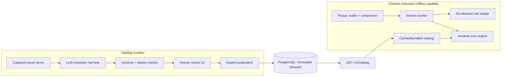

# Design

AI Checkout answers one question at an online checkout: **which card I already own earns the most here, and under what conditions?** This document explains how the system is split and why.

## Two systems, one contract

- **Shopper path (extension).** A deterministic TypeScript engine (`packages/rewards-core`) ranks the cards the user owns. It uses integer cents and basis points, handles caps, and turns unknown eligibility or cap usage into an explicit range instead of a guess. No model runs at checkout, so there is nothing to hallucinate and no API key or network call is needed.
- **Maintainer path (curation).** Issuer terms change and are written for humans. An LLM drafts structured rule changes from captured terms, every claim must cite an exact span of the source, and a human reviews and separately publishes. The only thing that crosses into the extension is a validated, published catalog release.

The shared Zod contract in `rewards-core` is enforced in the extension, the API, and (mirrored) in SQL, with 28 cross-layer parity cases.

## Why the LLM is where it is

The first prototype sent the cart and the whole card catalog to GPT and displayed whatever card it picked. That fails in the ways that matter: rates were strings, eligibility was the model's opinion, and nothing was reproducible. The redesign moves the model to the part of the problem that is genuinely language work (reading terms) and keeps arithmetic and ranking deterministic.

## Extraction harness (`apps/api/src/curation`)

| Concern | Approach |
| --- | --- |
| Versioning | Prompt, context envelope, output schema, and source policy are versioned together; a canonical context hash binds them into every trace |
| Untrusted input | Issuer text is data inside a JSON envelope; the system prompt instructs the model to report embedded instructions as issues. The corpus includes injection cases |
| Structured output | Strict JSON schema with explicit `known` / `unknown` / `conflicting` states; unknown values must be null |
| Grounding | Every known fact cites document ID, content hash, quote, and UTF-16 offsets; the validator rejects spans that don't match the source byte-for-byte |
| Budgets | Per-run token/time/attempt limits; spending reserved atomically in PostgreSQL before each call; ambiguous failures keep their reservation |
| Idempotency | A run ID can execute at most once, even across retries and instances |
| Authority | The model has no tools and no write path. Applying a draft and publishing a release are separate signed-in human actions |
| Traces | Private ledger of inputs, raw output, usage, cost, latency, and validation findings; replayable by the offline evaluator |

## Evaluation (`evals/curation`)

The evaluator scores saved traces against reference labels: exact field agreement, known-fact precision/recall, unsupported claims, condition and issue evidence coverage, false "clear" verdicts, refusals, latency, and cost. Development and reserved splits are separated by issuer family. The current corpus is synthetic and exists to regression-test the harness and scorer; a hand-labeled corpus of real issuer terms and live model comparisons is the next milestone.

## Database (`supabase/`)

Six migrations define public immutable releases and a head pointer, plus a private schema (not exposed through the Data API) for reviewers, source captures, drafts, extraction runs, and approvals. Publication is one transaction that checks the reviewer's live authority, the exact draft revision/hash, and the expected head, so stale approvals fail rather than overwrite. RLS, grants, and concurrent publication are covered by SQL and HTTP tests.

## Extension

Manifest V3 with only `storage`, `activeTab`, and `scripting`. The cart reader is injected only after the user clicks the toolbar button, reads bounded order-summary rows (never item names, addresses, or payment fields), and requires confirmation. The service worker persists all state so popup closure and worker shutdown are recoverable; Playwright tests load the packaged extension to cover those lifecycles.

## Scope

US/USD, cards the user already owns, supported merchants only (Best Buy US, Newegg US). Out of scope: bank linking, card numbers, payments, autonomous publication, broad scraping.

## Roadmap

1. Hand-labeled evaluation set from real issuer terms; compare models and prompt versions with measured deltas.
2. Grow the catalog to 10–15 popular cards through the curation pipeline.
3. ~~Hosted API and review app (Render + Supabase)~~ (done); publish the first reviewed release so the extension reads the hosted catalog.
4. Scheduled terms-change detection that re-runs extraction and opens a review item.
5. Chrome Web Store release.
