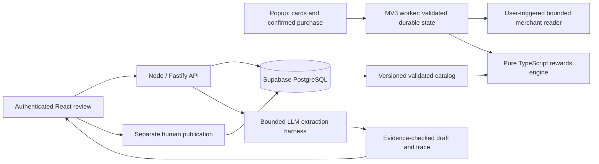

# Portfolio demonstration and claims

The [offline shopper recording](assets/shopper-demo.mp4) and [captioned gallery/transcript](assets/index.html) now demonstrate the actual packaged extension page using clearly labeled sample inputs. The recording covers protected setup, two owned cards, a $100 comparison, unknown cap usage, locking and confirmed deletion. The interface appears at its original 360×600 size inside a captioned presentation; it is an extension page recording, not a native toolbar popup recording. The store screenshots separately use genuine native-popup captures. [Provenance and regeneration](assets/README.md) bind both to the current ZIP.

The [56-second full-stack recording](assets/full-stack-demo.mp4) now shows the actual React review interface, compiled Node API, local Supabase Auth/PostgreSQL and an intercepted synthetic SDK response. Eleven captioned chapters cover source quotations, condition decisions, draft application, saved-run recovery, context/accounting and separate publication. [Transcript, provenance and reproduction](assets/full-stack-demo.md) record the exact source/build inputs and verified cleanup. The invented 2.5% example is not issuer evidence; scripted review clicks are not independent human annotation.

Both local demonstration segments are recorded. Live model measurements and hosted deployment evidence remain unfinished. No public traffic, customer savings or live model accuracy is claimed.

## Story to demonstrate

**Problem:** selecting an owned card depends on sourced rules and uncertain eligibility/cap usage. A plausible model answer is not enough to determine money. The extension calculates estimates from validated rules; a separate administrator workflow uses an LLM harness to propose source-grounded changes for human review.

Show these three connected parts:

1. **Shopper flow:** use the [manual two-card script](reviewer-instructions.md), show $3.00/$1.50 on a synthetic $100 eligible purchase with reported cap use zero, then clear reported spend and show the uncertainty range. Demonstrate offline operation and deletion. Show Newegg's explicitly labeled subtotal capture only if the live page is available; otherwise label the controlled fixture visibly.
2. **Full-stack review:** run the compiled review app and Node API against local Supabase. Demonstrate source evidence, exact revision/hash review, stale approval rejection, signed-session authorization and separate publication. The [review browser tests](../../apps/review/README.md) provide a reproducible synthetic environment; their passing state is not hosted evidence.
3. **LLM engineering:** walk through the actual versioned context/schema, immutable source identity, SDK boundary, evidence checks, cancellation/retry policy, durable budget reservations and uncertain-result recovery. Run the local evaluation diagnostic and explain its limitations before discussing results.

## Reproduce the existing evidence

With Node 24, dependencies and the project's local Supabase stack available:

```sh
npm run build
npm run test:browser --workspace=ai-checkout-extension
npm run test:browser --workspace=@ai-checkout/review
npm run eval:curation -- --check
```

Review browser tests provision and clean up synthetic local accounts/records. They are not a continuously available demo account or a hosted demo. Their intercepted SDK responses must be labeled **synthetic provider response; no live model call** in a recording. Do not put real tokens, database credentials, complete issuer captures or personal cart data on screen. See [evaluation procedure](../../evals/curation/README.md) for representative labels and funded live experiments that still need to be completed.

## Architecture to explain



The catalog-to-extension network arrow is optional in the current build and requires a deployed configured endpoint. The default extension uses its bundled snapshot. The LLM never chooses the shopper's reward arithmetic or obtains publication authority.

## Honest résumé wording at this checkpoint

- Built a React/TypeScript Manifest V3 extension with deterministic integer-money reward comparisons, explicit eligibility/cap uncertainty, local recovery and user-triggered merchant readers.
- Implemented a Node/Fastify and Supabase/PostgreSQL catalog workflow with signed-session authorization, source provenance, immutable releases and human approval bound to exact revisions.
- Engineered a bounded LLM extraction harness with structured outputs, citation validation, durable spending/concurrency controls, cancellation, trace replay and regression scoring; validated provider integration with intercepted transport.

Do not change the third bullet to “achieved X% model accuracy” until independently reviewed representative labels and an actual held-out experiment support it. The 60 synthetic cases are authored diagnostics; the abstaining baseline's 0/107 development known-fact recall is not a model benchmark. Likewise, local checks are not a deployed service or remote CI result.

## Evidence to add before the final portfolio release

Add a public store/deployment URL if achieved, normal Chrome and independent tester results, the independently reviewed and funded live evaluation report with failures/latency/cost, and a clean source revision plus reproducible commands. The completed full-stack segment exposes context/schema versions and accounting but does not demonstrate actual model quality. A deeper harness/evaluation explanation can accompany the eventual live report. Regenerate either local recording when its source/build inputs change. Describe remaining limits prominently. Prefer a few explainable engineering decisions over a longer list of unused tools.
