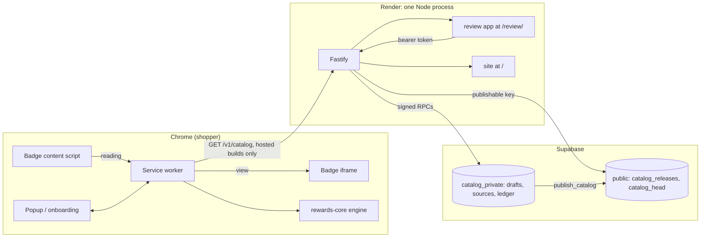

# Architecture

AI Checkout is two systems joined by one data contract. The **shopper side** is a Manifest V3 Chrome extension that reads a supported cart's order summary and ranks the cards the shopper owns with a deterministic engine; no model runs at checkout and wallet data never leaves the device. The **maintainer side** is a Fastify API, a review app and a Supabase PostgreSQL database: an LLM drafts card-rule facts from captured issuer terms, they are reviewed (agent-verified, with Evan approving), and publishing an immutable catalog release is a separate explicit step on Evan's approval of that one release ([catalog release](../ops/catalog-release.md)). The only thing crossing between the two is a validated catalog (`GET /v1/catalog`, Zod schema in `packages/rewards-core`).

Verified 2026-10-02 by reading the code at commit `f6d3f79` (branch `llm-wiki`); hosted behaviour was not checked. Component table, workspaces, migrations and catalog delivery rechecked against `main` `645b1c8` on 2026-10-05.

## Components

| Component | Path | Runtime | Responsibility | Page |
| --- | --- | --- | --- | --- |
| Popup, onboarding, worker, state | `extension/src/{popup,onboarding,background,state}` | Chrome MV3 service worker + extension pages | Wallet, settings, optional passphrase vault, manual comparison, savings history, catalog refresh | [Extension](extension.md) |
| Automatic cart badge | `extension/src/badge`, `extension/src/background/badge-service.ts` | Content script + extension iframe on the adapter hosts | Zero-click best-card pill on supported carts; order-page savings prompt | [Cart badge](cart-badge.md) |
| Site adapters | `extension/src/checkout` | Isolated-world content script | Declarative per-merchant cart readers (Best Buy US, Newegg US, Amazon US) | [Extension](extension.md#site-adapters) |
| Rewards engine and catalog contract | `packages/rewards-core` | Pure TS; imported by extension, API, review app, scripts | Catalog v1/v2/v3 Zod schemas, `compareRewards`, bundled `CATALOG_V2` and `CATALOG_V3` | [Rewards engine](rewards-engine.md) |
| Catalog client | `packages/catalog-client` | Browser + Node | Bounded, credential-free fetch and JSON read of `/v1/catalog` | [Extension](extension.md#catalog-refresh) |
| Review and curation contracts | `packages/catalog-review` | Browser + Node | Zod contracts for review RPCs, extraction input/trace, limits | [API](api.md), [Curation harness](curation-harness.md) |
| API | `apps/api` | Node 24, Fastify 5, one long-running process | `/health`, `/v1/catalog`, `/v1/review/*`, static hosting of review app and site | [API](api.md) |
| Curation harness | `apps/api/src/curation` | In the API process (v1 HTTP path) and local CLIs (v1/v2 evals) | Bounded LLM extraction, durable ledger, evaluation | [Curation harness](curation-harness.md) |
| Review app | `apps/review` | React 19 SPA served at `/review/` | Maintainer review, extraction review, explicit publication | [Review app](review-app.md) |
| Public site | `apps/site` | Static HTML served at `/` | Landing, eval results, architecture, privacy, support | [Public site](public-site.md) |
| UI library | `packages/ui` | React 19 components on Helios token names, Ocean theme values | Shared components for popup, badge, onboarding, review app, site | [UI library](ui-library.md) |
| Database | `supabase/` | PostgreSQL 17 + Supabase Auth/Data API | Immutable releases, head pointer, private drafts/sources/ledger | [Database](database.md) |
| Evaluation corpus and runs | `evals/curation`, `scripts/` | Local Node CLIs | Corpora, matrix runs, results in `docs/evals/` | [Evaluation](evaluation.md) |
| Card-expansion pipeline | `tools/catalog-pipeline` | Local Node CLI (`npm run pipeline`), never on Render | Batch state, gates, multi-batch catalog build, freshness, handoff, CLI publish on Evan's instruction | [Card-expansion pipeline](card-expansion-pipeline.md) |

## How it fits together

1. **Publication.** A reviewer signs in to the review app (Supabase Auth, session in tab memory), creates or edits a draft, attaches source captures, optionally runs extraction, then publishes. Since Phase 9 milestone 5 the coordinating session can do the same through the review API with `npm run pipeline -- publish` on a CLI session Evan logged in, only after his chat `publish <version>` ([catalog release](../ops/catalog-release.md#agent-publish-cli)). `publish_catalog` inserts a `catalog_releases` row and advances `catalog_head` in one transaction. See [Database](database.md).
2. **Catalog delivery.** `GET /v1/catalog` reads the head joined to its release in one Data API query and re-validates it with `catalogResponseSchema`; an expired or not-yet-valid release returns 503. The extension fetches it only when built with `VITE_CATALOG_API_URL` (`npm run build:hosted --workspace=ai-checkout-extension`); otherwise, and whenever the bundled catalog is the newer valid one, it uses the bundled `CATALOG_V3` ([extension](extension.md#catalog-refresh)).
3. **Checkout.** On a supported cart the badge content script reads the summary through the site adapter and sends only `{merchantId, amountCents, kind, extractorVersion}` (plus status) to the worker; the worker computes the comparison and serves it to the badge iframe. The popup can also read the active tab on demand (`activeTab` + `scripting`).

## Facts

| Fact | Value | Source |
| --- | --- | --- |
| Hosted service | Render web service `ai-checkout-api`, `plan: free`, `autoDeploy: true`, health check `/health` | [`render.yaml`](../../render.yaml) |
| Hosted build | `npm ci && npm run build` of the api, review and site workspaces; start `node apps/api/dist/index.js` | [`render.yaml`](../../render.yaml) |
| Curation on Render | `CURATION_ADAPTER=disabled`, `CURATION_ALLOW_METERED=false` | [`render.yaml`](../../render.yaml) |
| Extension permissions | `storage`, `activeTab`, `scripting`; host permissions = adapter hosts (`bestbuy.com`, `www.bestbuy.com`, `secure.newegg.com`, `www.amazon.com`) plus the catalog origin in hosted builds | [`extension/vite.config.ts`](../../extension/vite.config.ts) |
| Node | `>=24 <25` | [`package.json`](../../package.json) |
| Workspaces | `extension`, `packages/*`, `apps/*`, `tools/*` (one root lockfile) | [`package.json`](../../package.json) |
| Migrations | 10 files, `20260926032620` to `20261002230334` | [`supabase/migrations`](../../supabase/migrations) |

Hosted state (Supabase project, applied migrations, whether a release is published) is owned by [now.md](../now.md) and the ops pages, not here.

## Gotchas

- [`extension/manifest.json`](../../extension/manifest.json) has `host_permissions: []`. The real list, `content_scripts` and the badge's `web_accessible_resources` are written at build time by plugins in [`extension/vite.config.ts`](../../extension/vite.config.ts). Inspect `extension/dist/manifest.json`, not the source manifest.
- The extension's only network request is the catalog GET in hosted builds ([`packages/catalog-client/src/index.ts:createCatalogFetcher`](../../packages/catalog-client/src/index.ts)): no cookies, no referrer, no wallet or cart data.
- API, review app and site share one origin and one process; route precedence is on the [API](api.md) page.
- Live model calls run only locally through vendor CLIs on the developer's subscription (Codex, Claude Code). The hosted API never calls a model. See [Curation harness](curation-harness.md).

## Related

* [Code map](code-map.md)
* [Testing](testing.md)
* [Local setup](../ops/local-setup.md)
* [Goal](../product/goal.md)
* [Decisions](../decisions/index.md)
* [Glossary](../domain/glossary.md)
* Release and store materials (outside the wiki): [`docs/release/`](../../docs/release)
